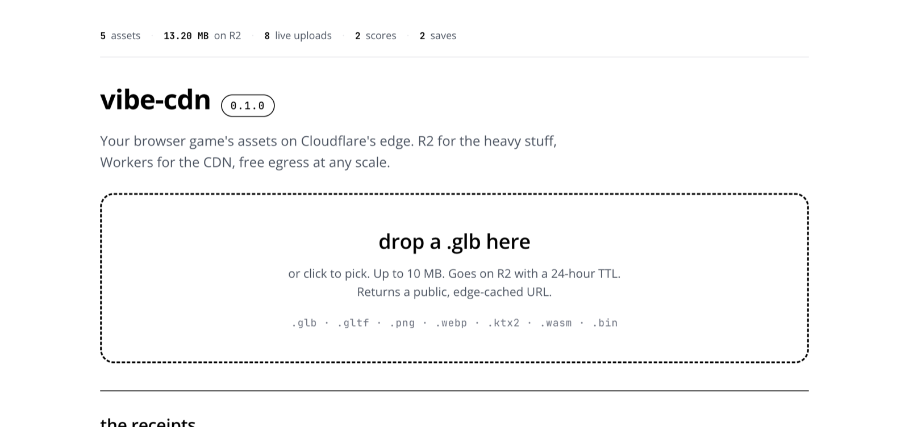
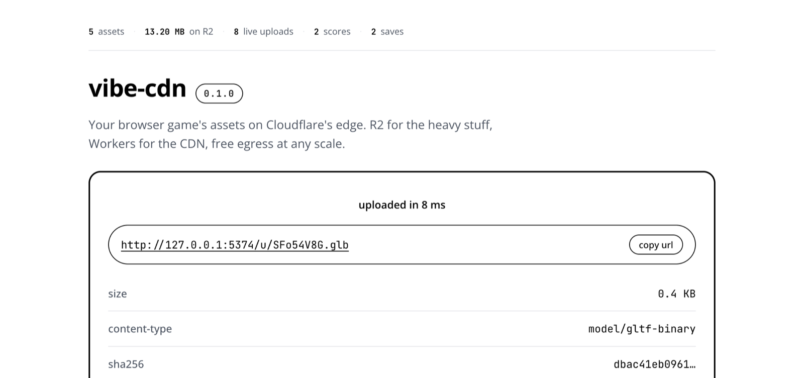
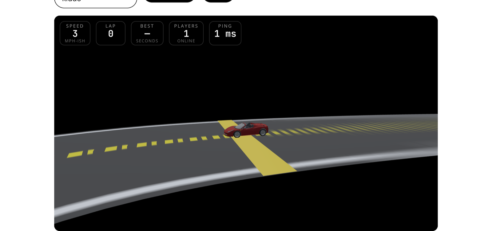

# vibe-cdn

> Your browser game's assets on Cloudflare's edge. R2 for the heavy stuff, Workers for the CDN, free egress at any scale.

[](https://vibe-cdn.coey.dev)
[](https://deploy.workers.cloudflare.com/?url=https://github.com/acoyfellow/vibe-cdn)
[](https://stackblitz.com/github/acoyfellow/vibe-cdn)
[](LICENSE)



Drag any `.glb` onto the page. Get back a public, edge-cached URL on Cloudflare's edge in one round trip.



Drive a Ferrari around an open arena. Every visitor on the same URL appears as a ghost car, synced through a Durable Object at 20 Hz.



## Quick start

Three options.

```bash
# 1. clone and run locally (best for hacking)
git clone https://github.com/acoyfellow/vibe-cdn
cd vibe-cdn
bun install
bun run demo
```

```bash
# 2. scaffold a fresh copy under your own repo name (best for shipping your own)
npx tiged acoyfellow/vibe-cdn my-game-cdn
cd my-game-cdn
bun install
bun run demo
```

[Open in StackBlitz](https://stackblitz.com/github/acoyfellow/vibe-cdn) — the local demo runs in your browser, no install required.

Then open the URL it prints. The page is the product:

- a **live stats ticker** counting real assets, requests, scores, saves
- a **drop zone** that accepts your model and gives back an edge-cached URL
- an **open multiplayer arena** — drive a Ferrari, see other visitors as ghost cars
- seven **receipts panels** below — every primitive on the stack, wired, probed, and clickable

No Cloudflare account required for the local run.

## Embed the arena in your own page

```html
<iframe
  src="https://vibe-cdn.coey.dev/embed/arena"
  style="width: 100%; aspect-ratio: 16/9; border: 0;"
  allow="autoplay"
  loading="lazy"
></iframe>
```

Visitors to your page join the same Durable Object room as visitors to vibe-cdn.coey.dev. It's one shared arena.

## What's in the box

| Primitive          | Used for                                  | Endpoint                          |
|--------------------|-------------------------------------------|-----------------------------------|
| **R2 (assets)**    | Big, immutable, content-addressable files | `/assets/:key`, `/manifest.json`  |
| **R2 (uploads)**   | Public ephemeral drops (24-hour TTL)      | `POST /api/u`, `/u/:key`          |
| **Workers**        | The CDN edge: MIME, Range, ETag, CORS     | every route above                 |
| **Durable Object** | Multiplayer rooms over WebSocket          | `/ws/lobby/:id`                   |
| **D1**             | Leaderboards + game saves                 | `/api/scores`, `/api/saves/...`   |
| **KV**             | Per-IP rate limits, edge caches           | (bound, used internally)          |
| **Live stats**     | Aggregated counts from the bindings       | `/api/stats`                      |
| **Cost model**     | Pure math, sliders to play with           | `/api/cost/estimate`              |
| **Embed view**     | Just the arena, no chrome, iframe-ready   | `/embed/arena`                    |

## How the asset path works

```text
GET /assets/demo/helmet.glb
    Range: bytes=0-1048575

1. Cloudflare edge:  cache lookup against the immutable URL
   HIT  → 206 from cache, never touches your Worker
   MISS → forward to Worker

2. Worker:
   R2.head(key) for size + ETag
   resolve Range against size
   R2.get(key, { range }) for bytes
   write headers:
     content-range: bytes 0-1048575/3773916
     content-type:  model/gltf-binary
     cache-control: public, max-age=31536000, immutable
     accept-ranges: bytes
     etag:          "abc123"
   → 206 Partial Content

3. Browser: Three.js GLTFLoader parses the bytes.
   Subsequent edge hits never touch R2 again.
```

R2 has **no egress fees**. Once an immutable URL is warm at an edge, all delivery from that edge is free. This is the magic.

## Commands

```bash
bun run demo       # the whole flow: migrate, start worker, seed, start app
bun run dev:app    # vite only
bun run dev:worker # wrangler only
bun run seed       # regenerate fixtures and re-upload to local R2
bun run optimize   # gltf-transform pipeline on a glb
bun run smoke      # end-to-end checks against the local worker
bun run check      # typecheck
bun run build      # build app + dry-run worker deploy
bun run deploy     # ship to your Cloudflare account
```

## Deploy your own

```bash
# 1. Bootstrap: create the bindings on your account
wrangler r2 bucket create vibe-cdn-assets
wrangler r2 bucket create vibe-cdn-uploads
wrangler r2 bucket lifecycle add vibe-cdn-uploads --id ttl --expire-days 1
wrangler d1 create vibe-cdn-db
wrangler kv namespace create SAVES

# 2. Paste the printed IDs into wrangler.jsonc under env.production.

# 3. Migrate the schema and ship.
wrangler d1 migrations apply vibe-cdn-db --remote
bun run deploy
```

Or click the [Deploy to Cloudflare](https://deploy.workers.cloudflare.com/?url=https://github.com/acoyfellow/vibe-cdn) button and Cloudflare provisions everything for you.

## More docs

- [`docs/architecture.md`](docs/architecture.md) — every route, every primitive, every diagram
- [`docs/costs.md`](docs/costs.md) — 1k / 50k / 5M player cost scenarios with line items
- [`docs/deploy.md`](docs/deploy.md) — production deploy guide
- [`docs/screenshots/`](docs/screenshots/) — drop zone, arena, hero

## Why this exists

Browser games (Three.js, WebGPU, cloth sims, racing games) hit the same wall at the same scale: "how do I serve a 200 MB asset bundle without going broke?"

Most CDNs charge per-GB egress. A viral browser game on a per-GB CDN can cost five figures a month. R2 has no egress, Workers handle the cache and routing, Durable Objects do rooms, D1 does scores. Same stack, fractional pennies at scale.

This repo bundles those primitives into one starter you can clone, deploy, and ship a game on the same day.

## Status

`0.1.0`. Local-tested. Production-tested at https://vibe-cdn.coey.dev.

MIT. Built by [@acoyfellow](https://x.com/acoyfellow).
